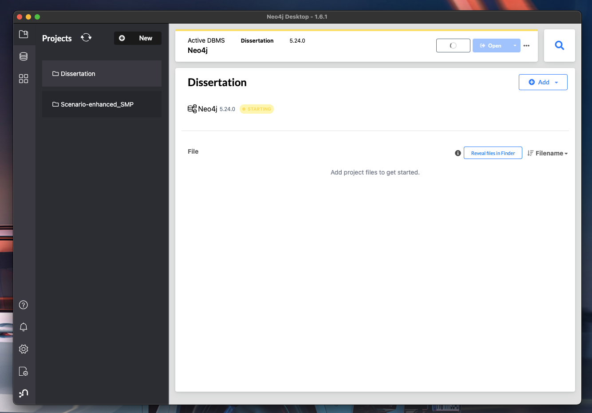
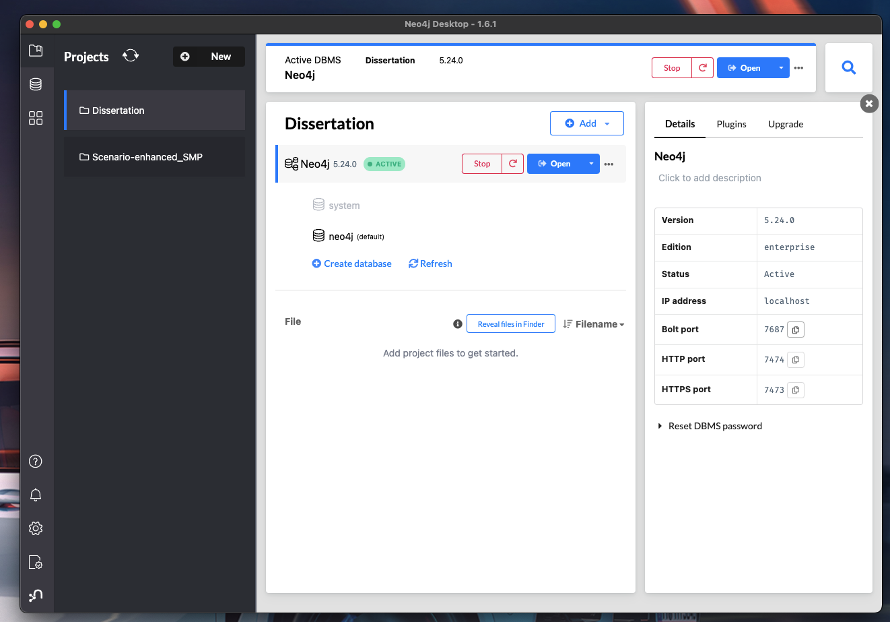

# Dissertation Figures Repository

This repository contains the figures for the dissertation. Each chapter has its own script to generate the figures.

## Folder Structure

```
/02_Monograph/03_Figures/dissertation_figures_repo/
│
├── constants.py
├── utils.py
├── models.py
├── launch_db.py
├── chapter_2.py
├── chapter_3.py
├── chapter_4.py
├── chapter_5.py
├── chapter_6.py
├── chapter_7.py
└── README.md
```

## How to Run the Scripts

To generate the figures for each chapter, run the corresponding Python script. Make sure you have all the necessary dependencies installed.


## Installation

Install this library in a `virtualenv` using pip. `virtualenv` is a tool to create isolated Python environments. The basic problem it addresses is one of dependencies and versions, and indirectly permissions.

With `virtualenv`, it's possible to install this library without needing system install permissions, and without clashing with the installed system dependencies.

[virtualenv documentation](https://virtualenv.pypa.io)

### Chapter 2
To install Neo4j Desktop and create a local database, follow these steps:

1. Download and install Neo4j Desktop from the [official website](https://neo4j.com/download/).
2. Open Neo4j Desktop and create a new project.
3. Within the project, click on "Add Database" and select "Local DBMS".
4. Choose the version of Neo4j you want to use and click "Create".
5. Set a password for the database when prompted.
{ width=50% }
6. Start the database by clicking the "Start" button. Make sure the Bolt port is 7687:
{ width=50% }

Once the database is running, you can connect to it using the Neo4j Browser or any Neo4j client.

```bash
python chapter_2.py
```
```bash
python chapter_2.py
```

### Chapter 3

```bash
python chapter_3.py
```

### Chapter 4

```bash
python chapter_4.py
```
### Chapter 5

```bash
python chapter_4.py
```

### Chapter 6

```bash
python chapter_4.py
```

### Chapter 7


### Querying the Google GDELT Knowledge Graph

In order to use this library, you first need to go through the following steps:

1. [Create a Cloud Platform project.](https://console.cloud.google.com/project)
2. [Enable a test period without billing.](https://cloud.google.com/billing/docs/how-to/modify-project#enable_billing_for_a_project)
3. [Enable the Google Cloud BigQuery API.](https://cloud.google.com/bigquery)
4. [Setup Authentication.](https://googleapis.dev/python/google-api-core/latest/auth.html)

```bash
python chapter_4.py
```


## Dependencies

Ensure you have the following dependencies installed:

- Python 3.x

You can then install the dependencies using:

```bash
pip install -r requirements.txt
```

## Contact

For any questions or issues, please contact [your email].
